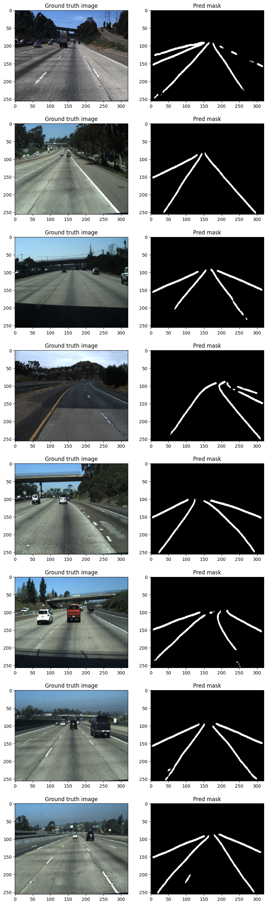

# Autonomous Driving Road Lane Detection

## Project Overview
This project focuses on the application of deep learning to enhance autonomous driving systems, specifically through road lane detection from dashcam images. By leveraging a modified ResNet50 architecture as the encoder and a custom decoder, the model successfully delineates road lanes, aiding in the navigation of autonomous vehicles.

## Technologies Used
- TensorFlow
- Keras
- scikit-learn
- OpenCV
- Matplotlib
- NumPy

## Dataset
The dataset consists of 7,252 preprocessed images divided into road scenes and corresponding ground truth masks. These images are used to train the model to differentiate between road lanes and the surrounding environment.

## Model Architecture
The model uses a modified ResNet50 architecture for feature extraction, coupled with a custom-built decoder using convolutional and transpose convolutional layers to generate precise lane predictions.

## Results
The model achieved:
- **Accuracy:** 97.81%
- **Precision:** 76.31%
- **Recall:** 72.07%
- **F1 Score:** 74.13%
- **IoU (Intersection over Union):** 58.89%

These metrics indicate the model's effectiveness in identifying and predicting road lanes accurately, making it a viable component for autonomous driving technologies.

## Visualizations
Below are some examples of the ground truth images alongside the predicted masks generated by the model:

## How to Use
1. Clone this repository.
2. Ensure you have all the required libraries installed.
3. Run the Jupyter notebooks to train the model or use the pre-trained weights for inference.

## Future Work
Further improvements can include enhancing the model's precision and recall through advanced training techniques and expanding the dataset for better generalization across different driving conditions.

